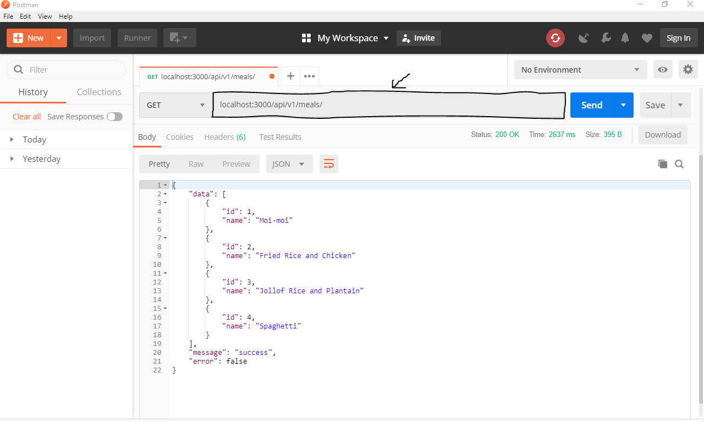

# Api Endpoints for meal Booking app


### SETUP

1. Download and install any of your preferred IDE

2. Download and install NodeJs

3. Download and install Git Bash

4. Download and install Postman


### INSTALLATION INSTRUCTION
1. clone or download this repository to any directory on local machine

2. open up Git bash terminal and CD (change directory) into the directory or
   right click on the repo folder and click on Git Bash here

3. cd into api folder

4. run ``` npm install ``` to install all the dependencies needed


### HOW IT WORKS
1. Open up Git bash terminal and CD (change directory) into the directory or
   right click on the repo folder and click on Git Bash here

2. Run ``` npm start ``` to start the application server

3. Open up Postman to test api endpoints

4. Api endpoint to ``` Get all meals ``` enter ``` localhost:3000/api/v1/meals/ ``` 
   in the Enter request url and click on send or press Enter key

   

5. Api endpoint to ``` Post a meal ``` change the ``` GET ``` to ``` POST ``` enter 
   ``` localhost:3000/api/v1/meals/ ``` in the Enter request url click on ``` Body ```
   select the ``` raw ``` option navigate to the ``` Text ``` with dropdown and choose 
   ``` jSON(application/json) ``` enter this format as shown to add a meal click ``` SEND ```
   and see it below been added

   

6. Api endpoint to ``` Update a meal ``` change the ``` GET ``` to ``` PUT ``` enter 
   ``` localhost:3000/api/v1/meals/5 ``` in the Enter request url click on ``` Body ```
   select the ``` raw ``` option navigate to the ``` Text ``` with dropdown and choose 
   ``` jSON(application/json) ``` enter this format as shown to update a meal click ``` SEND ```
   and see it below been updated

   

7. Api endpoint to ``` Delete a meal ``` change the ``` GET ``` to ``` DELETE ``` enter 
   ``` localhost:3000/api/v1/meals/5 ``` in the Enter request url click on ``` SEND ```
   and see the success message below

   

8. Api endpoint to ``` Post a menu ``` change the ``` GET ``` to ``` POST ``` enter 
   ``` localhost:3000/api/v1/menu/ ``` in the Enter request url click on ``` Body ```
   select the ``` raw ``` option navigate to the ``` Text ``` with dropdown and choose 
   ``` jSON(application/json) ``` enter this format as shown to add a meal click ``` SEND ```
   and see it below been added

   

9. Api endpoint to ``` Get menu ``` enter ``` localhost:3000/api/v1/menu/ ``` 
   in the Enter request url and click on send or press Enter key

   

10. Api endpoint to ``` Post orders ``` change the ``` GET ``` to ``` POST ``` enter 
    ``` localhost:3000/api/v1/orders/ ``` in the Enter request url click on ``` Body ```
    select the ``` raw ``` option navigate to the ``` Text ``` with dropdown and choose 
    ``` jSON(application/json) ``` enter this format as shown to post an order click ``` SEND ```
    and see it below been added

    

11. Api endpoint to ``` Update an order ``` change the ``` GET ``` to ``` PUT ``` enter 
    ``` localhost:3000/api/v1/orders/5 ``` in the Enter request url click on ``` Body ```
    select the ``` raw ``` option navigate to the ``` Text ``` with dropdown and choose 
    ``` jSON(application/json) ``` enter this format as shown to update an order click ``` SEND ```
    and see it below been updated

    

12. Api endpoint to ``` Get orders ``` enter ``` localhost:3000/api/v1/orders/ ``` 
    in the Enter request url and click on send or press Enter key

    

